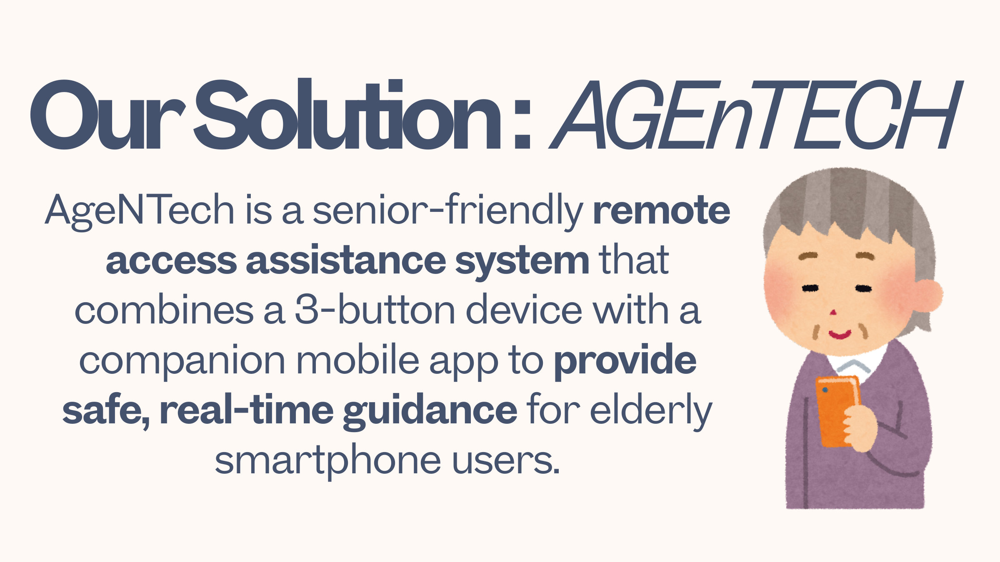
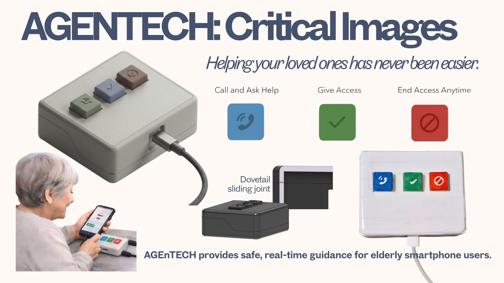
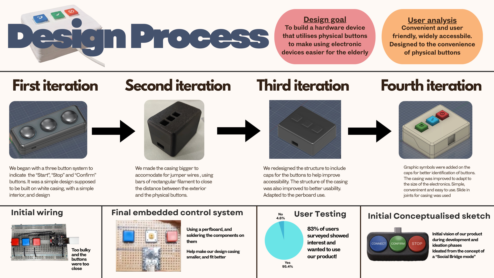

# Remote Assist Bridge

A hardware + software solution that enables elderly or non-tech-savvy users to request remote technical assistance with the press of a physical button. An ESP32-based remote control communicates over BLE with an Android app that automatically launches a TeamViewer QuickSupport session.

<p align="center">
  
</p>

## From the Pitch Deck (AGEnTECH)

This project was pitched as **AGEnTECH** — see the full deck: [`AGEnTECH_Pitch_Deck.pdf`](AGEnTECH_Pitch_Deck.pdf).

<p align="center">
  
</p>

<p align="center">
  
</p>

<p align="center">
  
</p>

## Overview

The system consists of two main components:

1. **Arduino Remote Control** — An ESP32 device with three physical buttons (Connect, Confirm, Stop) that sends BLE commands to the Android app.
2. **Android App (Remote Assist Bridge)** — Receives BLE commands from the remote and manages TeamViewer QuickSupport sessions accordingly.

### How It Works

1. The user presses the **Connect** button on the ESP32 remote.
2. The remote sends a `CMD:CONNECT` command over BLE to the paired Android device.
3. The Android app receives the command and launches TeamViewer QuickSupport.
4. The user presses **Confirm** to accept/start the session.
5. Pressing **Stop** sends `CMD:STOP`, which closes the TeamViewer session via an Accessibility Service.

## Project Structure

```
├── app/                              # Android application (Kotlin)
│   └── src/main/java/.../
│       ├── MainActivity.kt           # Main UI & BLE command handling
│       ├── UsbService.kt             # BLE scanning, connection & communication
│       ├── SplashtopController.kt    # TeamViewer session launcher
│       ├── StateMachine.kt           # App state management (Idle → Active → Session)
│       └── RemoteAccessibilityService # Auto-close TeamViewer on stop
├── arduino codes/
│   └── RemoteControl/                # ESP32 Arduino firmware
│       ├── RemoteControl.ino         # Main sketch — button reads & BLE sends
│       ├── ble_cmd.cpp/.h            # BLE initialization & command transmission
│       └── buttons.cpp/.h            # Button pin config, debounce & ISR
├── gradle/                           # Gradle wrapper & version catalog
├── build.gradle.kts                  # Root build script
└── settings.gradle.kts               # Project settings
```

## Hardware Requirements

- **ESP32 board** (e.g., ESP32-C3, ESP32-S3, or similar with BLE support)
- **3 push buttons** wired to the following GPIO pins:
  - `GPIO 20` — Connect
  - `GPIO 21` — Confirm
  - `GPIO 10` — Stop (with interrupt support)
- **Android device** running Android 6.0+ with BLE and TeamViewer QuickSupport installed

## Setup

### Arduino (ESP32 Remote)

1. Open `arduino codes/RemoteControl/RemoteControl.ino` in the Arduino IDE.
2. Install the ESP32 board package via Board Manager.
3. Select your ESP32 board and upload the sketch.
4. Wire the three buttons to the specified GPIO pins with pull-up resistors.

### Android App

1. Open the root project in Android Studio.
2. Sync Gradle and build the project.
3. Install [TeamViewer QuickSupport](https://play.google.com/store/apps/details?id=com.teamviewer.quicksupport.market) on the target device.
4. Deploy the app to the Android device.
5. Grant the required permissions (Bluetooth, Location, Accessibility Service).

## Permissions

The Android app requires:

| Permission | Purpose |
|---|---|
| `BLUETOOTH` / `BLUETOOTH_ADMIN` / `BLUETOOTH_SCAN` / `BLUETOOTH_CONNECT` | BLE communication with ESP32 |
| `ACCESS_FINE_LOCATION` / `ACCESS_COARSE_LOCATION` | Required for BLE scanning on Android |
| `CALL_PHONE` | Optional telephony feature |
| `KILL_BACKGROUND_PROCESSES` | Closing TeamViewer on stop command |
| Accessibility Service | Auto-close TeamViewer when stop is pressed |

## BLE Protocol

The ESP32 and Android app communicate using the Nordic UART Service (NUS):

- **Service UUID:** `6E400001-B5A3-F393-E0A9-E50E24DCCA9E`
- **TX Characteristic:** `6E400003-B5A3-F393-E0A9-E50E24DCCA9E`

### Commands

| Command | Trigger | Action |
|---|---|---|
| `CMD:CONNECT` | Connect button pressed | Initiates BLE connection & launches TeamViewer |
| `CMD:CONFIRM` | Confirm button pressed | Confirms/starts the remote session |
| `CMD:STOP` | Stop button pressed | Ends the session & closes TeamViewer |

## License

This project is for personal/educational use.
